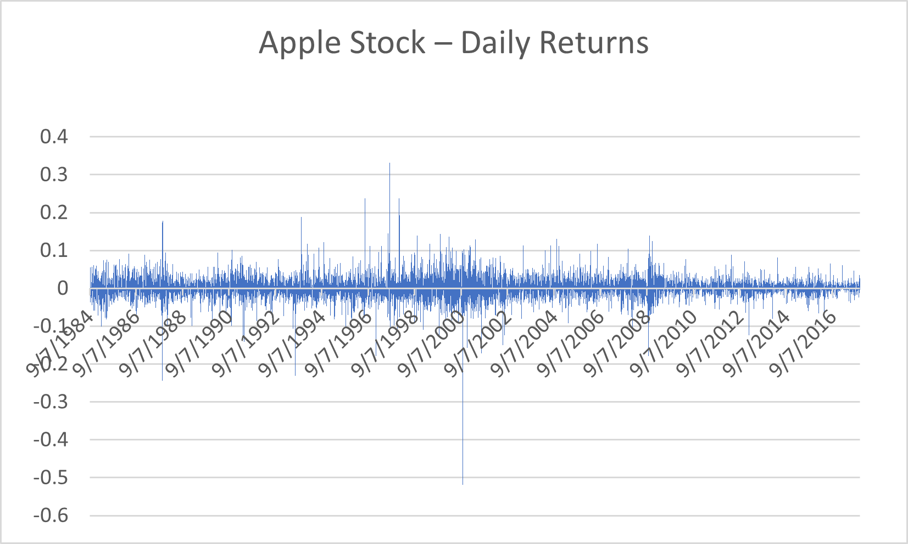

# Financial Data Analysis — Apple Inc. Daily Stock Returns
An exploratory financial data analysis project focused on understanding Apple Inc.'s daily stock returns, volatility, and risk using historical market data.

## Table of Contents
1. Overview
2. Data
3. Methodology
4. Results
5. Visualization
6. Interpretation
7. Skills & Tools
8. Author

## Overview
This project analyzes the daily stock price movements of Apple Inc. in order to understand its return, volatility, and risk characteristics.

## Data
The dataset contains historical daily stock data for Apple Inc., including:
- Date  
- Open price  
- High price  
- Low price  
- Close price  
- Volume  

The data was obtained from a public financial dataset (Kaggle – US stock prices).

## Methodology
To measure daily performance, **Daily Return** was calculated using the formula:

Daily Return = (Close_t − Close_{t-1}) / Close_{t-1}

This calculation was applied to all trading days using Microsoft Excel.

## Results
From the analysis, the following statistics were obtained:
- **Average Daily Return:** 0.00113 (≈ 0.113%)
- **Maximum Daily Return:** 0.332 (≈ 33.2%)
- **Minimum Daily Return:** −0.518 (≈ −51.8%)

These results show that Apple stock has a positive average return but also experiences significant short-term volatility.
## Visualization
A line chart was created to visualize daily returns over time, making it easy to identify periods of stability and high volatility.

## Interpretation
This analysis shows that:
- Apple Inc. has positive long-term growth, as indicated by the positive average daily return.  
- The large maximum and minimum daily returns highlight the stock’s high volatility, meaning there is both opportunity and risk for investors.

Such insights are important for investors, portfolio managers, and financial analysts when evaluating stock performance and risk.

## Skills & Tools
- Microsoft Excel (formulas, calculations, charts)
- Financial return analysis
- Data visualization
- GitHub portfolio documentation

## Author
**Nicat Aliyev**
